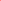
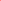
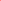
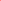

# Intent Canvas

[](https://react.dev/) [](https://www.typescriptlang.org/) [](https://vitejs.dev/) [](https://aistudio.google.com/)

A browser-first **spatial workspace** for turning business intent into inspectable computation. Place evidence, connect ideas, describe what you want — get back a plan you can trust, then execute.

## Showcase

| Section 1 — Intent as Input | Section 2 — Spatial Canvas |
|:---:|:---:|
|  |  |
| *Stop clicking buttons. Express intent.* | *Place evidence spatially. Let proximity become meaning.* |

| Section 3 — Inspectable Plan | Section 4 — Grounded Results |
|:---:|:---:|
|  |  |
| *Every step is explainable before it runs.* | *Every output is evidence-bound and validated.* |

> Screenshots are from the live canvas at 1280px — mobile reflow is verified at 390px with no overflow.

## Why Intent Canvas

Most tools force you to click through forms. Intent Canvas lets you **think spatially** — lay out datasets, documents, notes, and examples, connect what relates, and describe the outcome in plain language. The system compiles your spatial thinking into a plan you can inspect, not a black box.

## Product model

```
Context nodes + spatial relationships + user intent
                         |
                         v
                  SpatialGraphAST
                         |
                         v
                   Inspectable plan
                         |
                         v
                  User approval
                         |
                         v
                 Results on canvas
```

## What you can do

1. **Place** datasets, documents, notes, examples on the canvas
2. **Connect** with explicit edges; proximity (`240px` default) forms spatial clusters
3. **Describe** the outcome you want
4. **Inspect** the plan — sources, confidence, workflow, verification
5. **Approve** — plan is bound to this canvas state, runs once
6. **Receive** results as nodes you can keep, move, or save as a primitive

## Workspace features

- **Spatial** — pointer + keyboard, pan/zoom, drag, file drop, relationships
- **Nodes** — dataset, document, instruction, example, output, custom primitive; PDF/CSV/TXT/MD/JSON/raster uploads (SVG rejected)
- **Plan review** — context rationale, workflow stages, confidence, assumptions, constraints
- **Execution** — 4 capabilities: data patterns (safe SVG), document synthesis, meeting insights, UI concepts
- **State** — Zustand persists only bounded workspace data; transient plans/results are not persisted
- **Primitives** — compile your graph into a reusable custom primitive

## Capabilities

| Tool | Needs | Returns |
| --- | --- | --- |
| `DataPatternFinder` | Dataset | Observations, anomalies, safe SVG chart |
| `DocumentSynthesizer` | Document / dataset / instruction / example | Takeaways, connections, contradictions |
| `MeetingInsightExtractor` | Document / instruction | Decisions, action items, risks |
| `UIConceptGenerator` | Example + explicit UI intent | Hierarchy, styling, theme, `referenceBasis` |

Planner chooses the smallest useful set. No tool runs because its input exists.

## Quick start

```bash
npm install
cp .env.example .env   # add VITE_GEMINI_API_KEY
npm run dev            # → http://localhost:3000
```

Paste your Gemini API key in the top bar (or set `VITE_GEMINI_API_KEY`). Get one at https://aistudio.google.com/app/apikey — stored in `localStorage`, never sent elsewhere except `generativelanguage.googleapis.com`.

## Configuration

```env
VITE_GEMINI_API_KEY=AIza...
VITE_GEMINI_MODEL=gemini-2.5-flash
VITE_CANVAS_ID=workspace_canvas
VITE_SPATIAL_CLUSTER_ID=primary
VITE_PROXIMITY_DISTANCE_PX=240
VITE_DEFAULT_INTENT_PROMPT=Analyze the supplied context, identify the most useful supported outcome, and propose grounded next steps.
VITE_PRIMITIVE_TITLE=Evidence-Based Risk & Opportunity Primitive
VITE_PRIMITIVE_DESCRIPTION=User-composed dynamic computational primitive
```

## Limits — intentional bounds

- Upload 10 MB, PDF text 10k chars, image preview bounded, SVG rejected
- Workspace: 30 nodes, 60 edges, output 100 KB
- Inline SVG sanitized and bounded
- Browser persistence is per-profile, not multi-user

## Scripts

```bash
npm run dev      # Vite dev
npm run build    # tsc + vite build → dist/
npm run preview  # serve dist
```

Deploy `dist/` to any static host.

Built for the NYC Codex Community Hackathon — where spatial thinking becomes an inspectable plan.
